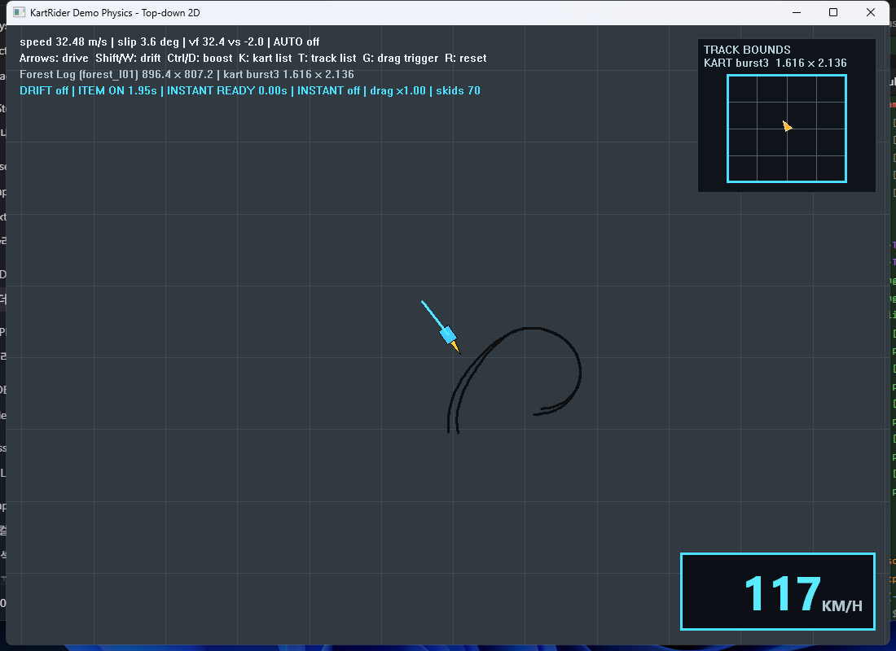
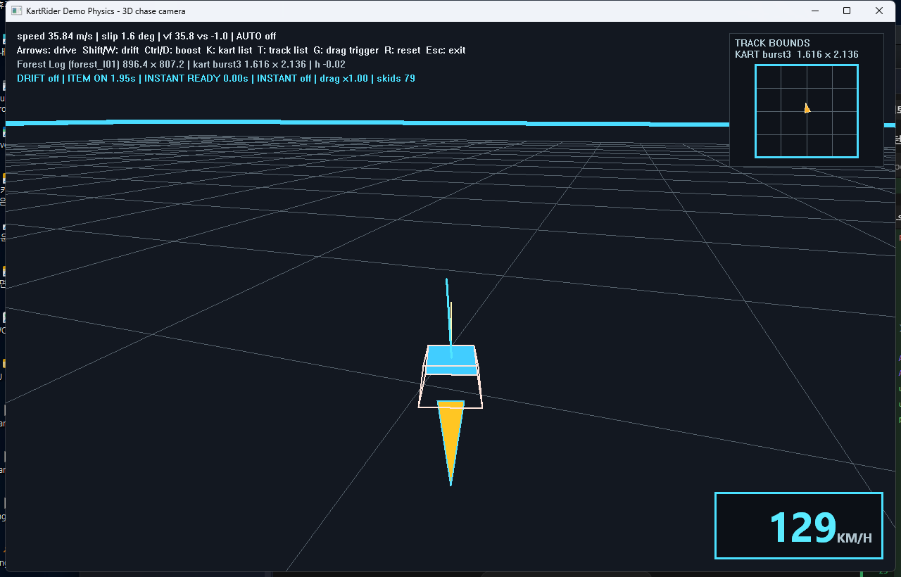

# KartRider Demo physics recovery

This workspace contains a clean C reconstruction of the kart dynamics code in
the 2004 `KartRider.exe` demo. It is an evidence-driven behavioral recovery,
not the original source code.

## Simulator preview

### Top-down



### 3D



Both views run the same 3D physics state and 5 ms substep pipeline, and they are
one program: the top-down renderer projects that state onto X-Y, the 3D renderer
draws it with the existing fixed chase camera, and `C` switches between them.
These screenshots were captured from the current Windows build while drifting
and using the item boost.

## Run the included simulators

No build is required to try the checked-in applications.

On **Windows**, open this file:

- `build-win/kart.exe` — both views in one program; `C` switches between the
  3D chase camera and the top-down projection

The Windows executable is self-contained and can be copied by itself to
another 64-bit Windows 10/11 computer. No asset directory or separate MinGW
runtime DLL is required.

On **macOS**, open one of these application bundles:

- `build-macos/Kart Physics Top Down.app` — top-down view
- `build-macos/Kart Physics 3D.app` — 3D chase-camera view

On macOS, if Gatekeeper blocks the first launch, Control-click the application,
choose **Open**, and confirm once. The ZIP files in `build-macos` are optional
distribution copies; the `.app` bundles are the files to run directly.

## Read the recovery

- **[Physics engine textbook](docs/PHYSICS_ENGINE_TEXTBOOK.md)** builds the
  current implementation bottom-up from vectors and coordinate axes through
  suspension, tire forces, drift states, boosts, drag, collision, and
  quaternion integration. Its equations and update order follow the C code.
- **[Track code mapping](docs/TRACK_CODE_MAPPING.md)** maps the verified
  `T`-menu codes to their Korean original names, historical Item/Racing
  classification, and 1–5 difficulty ratings.
- **[Track asset pipeline](docs/TRACK_ASSET_PIPELINE.md)** documents the
  read-only RHO inventory, minimap/texture extraction, `track.1s` decoding,
  and C-friendly KTRK mesh preparation.
- [Recovery notes](analysis/RECOVERY_NOTES.md) connect recovered formulas to
  executable addresses and supporting reports.
- [Differential-oracle results](analysis/RECOVERY_NOTES.md#differential-oracle-results)
  record the original-EXE calls and frame-by-frame comparison results; the
  captured CSV references are in [`analysis/reports`](analysis/reports/).

## Current recovered scope

- the complete `Dynamics` parameter list and original fallback values;
- speed-attenuated steering angle;
- front/rear lateral slip and tire force calculation;
- grip, drift, and drift-trigger force modes;
- local lateral force plus roll/yaw torque outputs.
- four-contact suspension and gravity response;
- drift input/trigger state and original timing;
- linear/angular air drag and grounded quadratic drag;
- fixed-step linear velocity integration.
- the original `speed <= 5` non-drift lateral branch and `CornerDrawFactor`
  forward draw force;
- the runtime grounded-drag field, including the original `x4` enter and
  `x0.25` leave transitions;
- triangle-contact linear collision response with the original restitution and
  tangential-loss constants.
- forward, reverse, drift-escape, boost, grip-brake, and slip-brake forces.
- inverse-inertia construction and angular velocity integration.
- four-wheel ray contact generation and compression history;
- quaternion pose integration and the original anti-flip retry guard;
- hard/late body-collision angular response;
- an engine-independent world-query interface and complete fixed 5 ms
  simulation pipeline.
- the complete `ChaseCameraman` mode-0 update: a persistent camera quaternion
  interpolating toward the kart's orientation at `min(dt / 400 ms, 1)` — which
  is what leaves the kart visibly turned across the view during a deep drift —
  an asymmetric speed filter (10 s easing out, 100 ms pulling in), chase pitch
  `speed/400 + 0.25`, rear distance `5.5 + speed*0.045`, height `speed/60 + 3`,
  a booster-linked 75-to-110 degree field of view, and the Z-only smoothing of
  the final camera position. See
  [camera recovery notes](analysis/CAMERA_RECOVERY_NOTES.md).
- the kart sound driving from `FUN_00452E60`: the engine loop's pitch and
  volume both follow `speed * 0.01171875 + 0.25`, refreshed only every 64 ms,
  with volume pinned at 1.0 from speed 64 and pitch pinned at 1.5 from speed
  128; the drift loop runs exactly while the kart's drift flag is set; the
  booster is triggered by the same flag that widens the chase camera's field of
  view; crash and shock are one-shots at `clamp(magnitude * k, 0.1, 1.0)` with
  `k` of 0.1 and 0.04. See [the sound section](#sound) below.
- the original HUD `|velocity| * 3.6` km/h conversion;
- all 26 playable demo kart presets, checked against the demo's own
  `Data/kart.rho`: 416/416 `Dynamics` values match each kart's `parameter.xml`,
  and all 78 dimension constants are reproduced exactly from the body mesh of
  its `model.1s`. See
  [kart asset verification](docs/KART_ASSET_VERIFICATION.md); re-run it with
  `python scripts/derive_kart_constants.py`. The kart's drawn **shape** is not
  from the assets — it is a box built from those dimensions.
- all 13 demo track mesh-AABB sizes, every one of them re-derived from that
  track's decoded `track.1s` mesh so the scene, walls, minimap and spawn share
  one source.

The source addresses are recorded next to recovered formulas. Raw Ghidra output
and ranking reports are kept under `analysis/reports`; reusable headless scripts
are under `scripts/ghidra`.

## Binary differential verification

`kart_binary_oracle.exe` starts the installed 32-bit demo, allocates an isolated
synthetic kart object, and calls the original fixed-address physics functions.
It does not modify the live game kart or save data. Two captured references are
kept under `analysis/reports`:

- 140 lateral-force/state frames covering grip, trigger, held drift, release,
  linger, and automatic slip;
- 240 chained frames covering force accumulation, drag, velocity integration,
  pose integration, and drift entry/maintenance/exit.

The current recovered implementation scores `1.000000` average similarity in
both suites. The trajectory suite's worst normalized scalar similarity is
`0.999989`, with zero drift-flag mismatches. These numbers describe the tested
synthetic flat/planar scenarios, not the unrecovered proprietary track query.

## Build from source

```powershell
cmake -S . -B build
cmake --build build
ctest --test-dir build --output-on-failure
```

`kart_simulation.h` exposes callbacks for ground rays and body contacts. This
keeps the recovered dynamics independent of the demo's proprietary scene and
triangle-query implementation while preserving the original query geometry
and update order.

After a Windows build, launch `build/kart.exe`. It uses the following controls:

| Action | Windows | macOS |
|---|---|---|
| Accelerate / brake or reverse | Up / Down | Up / Down |
| Steer | Left / Right | Left / Right |
| Drift | Shift or `W` | Shift or `W` |
| 3-second item boost | Ctrl or `D` | Command or `D` |
| Switch camera (chase / top-down) | `C` | — |
| Show or hide the motion vectors | `V` | — |
| Open the kart parameter editor | `P` | — |
| Choose kart / track | `K` / `T` | `K` / `T` |
| Toggle grounded-drag trigger | `G` | `G` |
| Save a screenshot | `S` | — |
| Dismiss the `K` / `T` menu | `Esc` | `Esc` |
| Reset (the countdown only reruns on a track change) | `R` | `R` |

`Esc` only closes the kart and track menus. The window is closed the usual way,
with Alt+F4 or the title bar. Keys are ignored unless the demo window is the
foreground window, so the kart will not drive while you are typing elsewhere.

Press `K` or `T` to open a selectable list. Use the mouse, or the arrow keys
and Enter, to apply one of the 26 kart presets or 14 track bounds immediately.
The track list shows the supplied Korean public name, original `I`/`R` mode
classification, and difficulty for all 13 identified tracks, plus the synthetic
`flat_test` reference track described below. The Track Map
panel uses each archive's original `xt_minimap.png`, and every track resets at
the centre of its decoded start-line road quad. Only Forest Log and Village
Overpass have their start *direction* checked against the original game; see
the confidence boundary below.
Both views live in the same executable and share one simulation, so `C` switches
between them without disturbing the kart.

### Telemetry panels

Beyond the HUD's debug lines, the window shows three read-outs. The bottom-left
panel lists the whole rigid body state: drift phase and slip angle, position,
velocity, acceleration, angular velocity, body-axis speeds and `up_z`, the
steering and drift timers, boost timers, the active force and drag constants,
and what the last step resolved. Above the speedometer, a wheel figure shows
each suspension contact's compression over its tire. `V` overlays the kart's
motion vectors: velocity, its forward and lateral split, and the acceleration
the last step produced.

`P` opens a parameter editor over the running kart's `KartDynamicsConfig`.
Edited values apply on the next step without a reset; **Kart defaults** restores
the selected kart's own `parameter.xml` values.

### `flat_test` reference track

The demo opens on `flat_test`, a synthetic track with **no mesh**: just the
flat ground plane and the cyan AABB walls. It exists to isolate the recovered
physics from the decoded scene geometry, so anything odd on screen is the
dynamics rather than a triangle query. Its footprint matches Forest Log
(`896.391 x 807.183`) and it is centred on the world origin. Press `T` to switch
to any of the 13 real tracks.

### World axis gizmo

Both views draw a **world** X/Y/Z triad below the HUD's debug lines in the
top-left corner: X red, Y
green, Z blue, in the usual convention. The arrows always show the world frame,
never the kart's body axes, so the widget shows how the world is oriented from
the current viewpoint — in the 3D demo it turns as the chase camera yaws. An
axis pointing nearly straight at or away from the camera has no useful screen
direction, so it is drawn with the "out of / into the page" ring symbol instead
of an arrow; in the top-down view that is always Z.

## Top-down view

The `C` key's top-down renderer runs the full 3D
physics state and renders only the X-Y projection using the
Win32 API, so no graphics package is required. It starts on `cotten5` on the
`flat_test` reference track — the kart is a simulator-side choice, since the
demo's own `kartlist.xml` offers only `burst3`. The camera follows the kart over a
10-unit reference grid. The top-right bounds panel shows the full track, the
selected kart's exact width and length, and its current position as an oriented
triangle.

The camera is oriented so world **+Y points up** the screen and world +X points
left, matching the original minimap artwork, so the main view and the Track Map
panel always agree. Both axes are negated together, which is a rotation rather
than a mirror, so steering handedness is unchanged.

- Up: accelerate
- Down: reverse or brake
- Left, Right: steer
- Shift or `W`: drift
- Ctrl or `D`: start the original 3-second item boost
- `C`: switch between the chase camera and the top-down projection
- `V`: show or hide the motion vectors
- `P`: open the kart parameter editor
- `K`: open the 26-entry kart selection list
- `T`: open the 14-entry track selection list
- `G`: emulate the original ground-drag trigger enter/leave (`x4` / `x0.25`)
- `S`: save a screenshot
- `R`: reset

Both views show a large lower-right km/h gauge. The `K` and `T` popup
lists support mouse selection or the arrow keys and Enter, and check the
currently active preset.

The recovered original instant boost is automatic: finish a forward drift,
release Up, then press Up again while the HUD shows `INSTANT READY` (a 0.5
second window). It applies the original 1.5x forward-force multiplier for 0.5
seconds. Ctrl/`D` remains the separate external boost control.
The item boost starts only on a new key press while accelerating, lasts 3000
milliseconds, and ignores further booster presses while item or instant boost
is already active. Release and press Ctrl/`D` again after expiry to reuse it.

During any drift state, the renderer leaves fading twin rear-wheel skid marks.
Boost is shown by a cyan kart, a rear flame, and a `BOOST ON` HUD indicator.
For the original new-cut input, keep the first steering direction held and
press the opposite direction during the same drift. The most recently pressed
direction owns steering instead of the two keys cancelling to zero, so the
existing opposite yaw torque can straighten the kart without a guessed extra
force.

## 3D view

The startup view uses the same recovered
physics and world callbacks, with a software-rendered perspective chase camera.
All 13 real tracks embed and draw the decoded original `track.1s` KTRK scene
mesh; `flat_test` deliberately has none.
The scenes are stored as raw DEFLATE inside the executable and inflated at
startup by `src/kart_inflate.c`, which keeps 12.1 MB of mesh data down to
3.7 MB of resources and needs no external library. No asset directory is needed
at run time.
Every mesh in an embedded scene is solid, scenery included. What a face is used
for comes from its **normal**, not its name: `|n_z| >= 0.20` is drivable ground
for the wheel rays, `|n_z| <= 0.55` is a wall for the body. The `road`/`wall`
flags come from substring matches on node names, which are unreliable enough
that they now only pick the wireframe colour — they miss Korean node names
entirely, and used to let the kart drive straight through rocks and ledges.
Meshes are rejected by their bounds before any triangle is tested, so covering
the whole scene costs 0.8–2.5% of a 5 ms substep. The recovered rectangular AABB
remains an outer safety wall. The kart body is sized from the selected model
AABB.

Those collision faces are also shaded, translucently, so the surface the physics
actually uses is visible rather than inferred from wireframe alone: warm sand
for ground, blue for walls, using the same thresholds as
`src/kart_track_collision.c`. The fill is composited at roughly one third
opacity, so the wireframe and the ground grid stay readable through it.

### Sound

The Windows build plays the demo's own effect samples — `motor.wav`,
`drift.wav`, `crash.wav` and `shock.wav` from `kart.rho`, and
`booster/booster.wav` from `sound_fx_item.rho`. All five are 16-bit mono
22050 Hz PCM and are embedded in the executables byte for byte.

The driving logic in `src/kart_engine_sound.c` is recovered from `FUN_00452E60`
and `FUN_00458000`; `tests/test_engine_sound.c` pins its constants. Playback is
`demo/kart_audio_win32.c`, a small streaming mixer over `waveOut` with per-voice
looping, volume, and pitch by resampling — no third-party audio library. A
machine with no output device simply runs silent.

Two details worth knowing. The engine volume curve is continuous, reaching 1.0
exactly at speed 64, but the pitch curve is not: just under speed 128 the ramp
has reached about 1.75 and then steps down to the 1.5 cap. That is what the
original does. And there is no separate instant-boost sound — the original
triggers `booster.wav` from the kart's vftable slot 26 flag, which covers the
item boost and the instant boost alike.

### Race start countdown

The demo opens on a countdown recovered from `FUN_00451EB0` / `FUN_00456CD0`,
which are the same state machine at two different field offsets. Entering the
ready state sets `deadline = now + 7000 ms`; the cues then fire as the deadline
approaches, each tested as `deadline <= now + offset`:

| Threshold | Cue |
|---|---|
| `deadline - 3000` | `count_3` |
| `deadline - 2000` | `count_2` |
| `deadline - 1000` | `count_1` |
| `deadline` | `count_go`, every kart released |

The throttle does nothing until GO. Pressing forward within **±100 ms** of the
deadline grants a **1000 ms** boost — the start boost, from the accelerate
action of the input handler `FUN_004529D0`. It runs through
`GoKart_StartTimedBoost` at `0x00431AB0`, which raises the same flag vftable
slot 26 reports, so it drives the booster sound and the camera's wide field of
view exactly like an item boost. The lights run once per race: `R` and the
out-of-world respawn put the kart back on the line without them, and a track
change starts a new race and reruns them. Holding drift with the throttle before
GO revs the booster — the idle loop plays and the kart takes on the boost look,
but no other booster works until the line drops.

One simulator-side rule: releasing the accelerator ends a boost immediately
rather than letting its timer run out. The original only expires the timer.

### Falling out of the world

The scenes only carry road triangles where the original track had road, so
leaving the road — off an edge, or through a gap at speed — drops the kart into
a void it can never land in. The simulator detects this and respawns
automatically, showing `FELL THROUGH THE TRACK - RESPAWNED` for a moment. The
threshold is `kart_demo_track_fall_limit()`: 40 units below the lowest geometry
in that scene, far enough that landing hard on the lowest road never trips it.
Its input signs, frame stepping,
runtime drag trigger, item/instant boost handling, and
kart/track selection match the top-down demo. Fading rear-wheel skid marks,
boost flame and body color, heading/velocity vectors, slip telemetry, and the
full boost/drift HUD are projected into the chase-camera view. Controls match
the top-down demo. The ground grid follows the camera over the large original
track footprint, boundary lines are clipped at the camera near plane instead
of disappearing, and the top-right bounds map keeps the cyan track perimeter
visible even when the physical wall is hundreds of metres away. Both bounds
maps use an oriented kart triangle without a separate direction-vector line.
Escape
additionally closes the window.

## macOS demos

The same top-down and 3D simulations can be built as native Cocoa application
bundles on macOS. The macOS renderer uses only AppKit/Core Graphics supplied by
the operating system; no third-party graphics package is required. Physics,
kart/track presets, flat-world collision callbacks, skid marks, bounds map,
speedometer, and the `K`/`T` selection menus are shared in behavior with the
Windows demos. The existing fixed 3D chase view is preserved.

On a Mac with CMake and either Xcode or the standalone Xcode Command Line
Tools installed:

```sh
bash scripts/build_macos.sh
```

This builds and tests both applications, then creates directly executable app
bundles plus ZIP copies for distribution:

- `build-macos/Kart Physics Top Down.app`
- `build-macos/Kart Physics 3D.app`
- `build-macos/kart_topdown-macos.zip`
- `build-macos/kart_3d-macos.zip`

CMake's intermediate files are kept separately in the hidden
`.build-macos` directory; only `build-macos` contains files intended for use or
distribution.

macOS uses native `.app` bundles rather than Windows `.exe` files. Extract a
zip and open the contained application. The script applies a local ad-hoc
signature; because it is not an Apple Developer ID signature, the application
may require Control-click, then **Open**, the first time it is launched.

Controls match Windows except that the item-boost modifier is **Command**:

- Arrow keys: drive and steer
- Shift or `W`: drift
- Command or `D`: boost
- `K`: kart list
- `T`: track list
- `G`: grounded-drag trigger
- `R`: reset

## Confidence boundary

Parameter names/defaults and the core formulas are directly supported by the
listed executable addresses in `analysis/RECOVERY_NOTES.md`. Kart dynamics and
dimensions are verified against the demo's own `kart.rho` by
`scripts/derive_kart_constants.py`; the kart's drawn shape is not, and remains a
box rather than the asset mesh. All 13 track bounds and start
lines are derived from the decoded `track.1s` meshes by
`scripts/derive_track_constants.py`, and all 13 use the selected yellow KTRK
triangles for ground and wall contact on Windows. The exact proprietary
node-selection query is still not claimed as recovered.

The start **direction** is the weakest link. A start line's position and its
axis are readable from the stripe quad, but nothing in `track.1s` records which
way round the lap is driven, so the simulator assumes the **positive world
axis**: a Y-axis start line faces world +Y, an X-axis one faces world +X. Those
are the same axes the corner gizmo shows. The track
table grades each entry:

| Grade | Tracks | Meaning |
|---|---|---|
| `confirmed` | `forest_I01`, `village_R01` | direction compared against the original game |
| `assumed dir` | 9 tracks | stripe clearly elongated, so the axis is certain; the sign is assumed |
| `assumed axis` | `ice_I01`, `ice_I02`, `ice_R01` | start quad nearly square, so even the axis is a guess |

A wrong sign only means the kart starts facing backwards; press `R` after
turning around. Correcting one is a single enum change in `src/kart_demo_data.c`.
