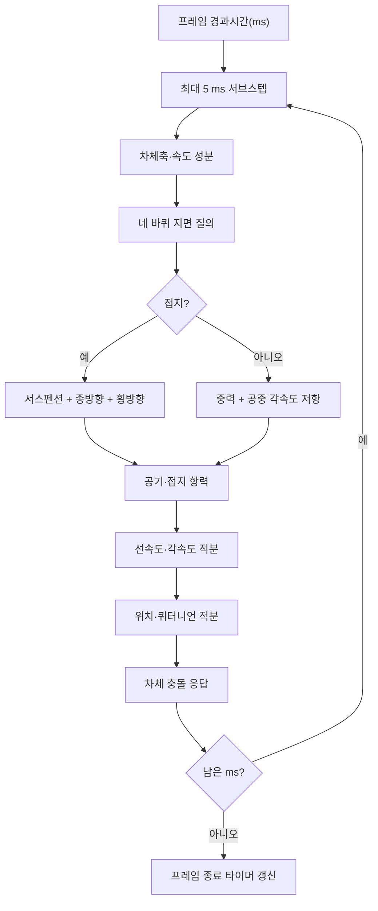

# KartRider 데모 물리엔진: 벡터에서 완성 시뮬레이션까지

이 문서는 이 저장소에 **현재 구현되어 있는 물리엔진**을 아래에서 위로 조립하듯 설명한다. 목표는 결과만 나열하는 것이 아니라, 3차원 벡터 하나에서 시작해 접지·타이어·드리프트·부스터·충돌·쿼터니언 자세 적분이 한 프레임 안에서 어떻게 연결되는지 재현 가능한 형태로 보여주는 것이다.

구현의 중심은 다음 파일이다.

- [`include/kart_dynamics.h`](../include/kart_dynamics.h): 물리 입력·출력·상태 자료형
- [`src/kart_dynamics.c`](../src/kart_dynamics.c): 복구된 힘, 토크, 상태기계와 적분식
- [`include/kart_simulation.h`](../include/kart_simulation.h): 월드 질의와 완성 시뮬레이션 API
- [`src/kart_simulation.c`](../src/kart_simulation.c): 5 ms 고정 서브스텝 파이프라인
- [`src/kart_demo_data.c`](../src/kart_demo_data.c): 26개 카트와 15개 트랙의 원본 데이터
- [`analysis/RECOVERY_NOTES.md`](../analysis/RECOVERY_NOTES.md): EXE 주소와 역분석 근거

> 현재 시뮬레이터의 트랙 월드는 원본 트랙 메시가 아니라 각 트랙의 정확한 전체 AABB를 사용한 평면 직사각형이다. 카트의 힘·상태·적분은 원본 EXE에서 복구했지만, 독점 트랙 공간 인덱스와 삼각형 질의는 콜백 경계 바깥에 남아 있다.

## 읽는 순서

이 문서는 의존성이 생기는 순서대로 네 층을 쌓는다.

1. **수학 바닥(1~4장):** 벡터, 차체 좌표축, 상태, 5 ms 시간 조각
2. **노면과 조종(5~13장):** 바퀴 접촉, 서스펜션, 조향, 타이어,
   드리프트, 종방향 힘, 두 부스터, 항력
3. **강체 갱신(14~19장):** 힘·토크 합산, 선·각속도, 쿼터니언,
   충돌, 전체 서브스텝
4. **제품화와 검증(20~25장):** HUD, 시각화, 카트·트랙 자료,
   바이너리 차등 검증, 구현 순서와 정확성 경계

앞 장의 기호를 뒤에서 그대로 사용하므로 처음 읽을 때는 순서대로,
구현을 대조할 때는 19장의 전체 의사코드에서 필요한 장으로 거슬러
올라가는 방식이 좋다.

## 1. 가장 작은 재료: 스칼라와 3차원 벡터

카트의 위치, 속도, 힘, 각속도, 토크는 모두 3차원 벡터로 표현한다.

$$
\mathbf{a}=(a_x,a_y,a_z)
$$

### 1.1 덧셈과 스칼라배

$$
\mathbf{a}+\mathbf{b}
=(a_x+b_x,\;a_y+b_y,\;a_z+b_z)
$$

$$
s\mathbf{a}=(sa_x,\;sa_y,\;sa_z)
$$

힘을 합산하거나 속도로 위치를 전진시킬 때 사용한다.

### 1.2 내적: 한 축으로 얼마나 향하는가

$$
\mathbf{a}\cdot\mathbf{b}
=a_xb_x+a_yb_y+a_zb_z
$$

단위축 $\hat{\mathbf e}$에 대한 벡터 $\mathbf v$의 성분은 다음과 같다.

$$
v_e=\mathbf v\cdot\hat{\mathbf e}
$$

이 엔진에서 내적은 다음 질문에 답한다.

- 속도가 카트 전방으로 얼마나 향하는가?
- 옆으로 얼마나 미끄러지는가?
- 충돌면 안쪽으로 들어가고 있는가?
- 지면 법선과 차체 위쪽 축이 얼마나 일치하는가?

### 1.3 외적: 회전축과 토크

$$
\mathbf a\times\mathbf b=
\begin{pmatrix}
a_yb_z-a_zb_y\\
a_zb_x-a_xb_z\\
a_xb_y-a_yb_x
\end{pmatrix}
$$

접촉점의 지렛대 벡터 $\mathbf r$에 힘 $\mathbf F$가 작용하면 토크는 다음과 같다.

$$
\boldsymbol\tau=\mathbf r\times\mathbf F
$$

### 1.4 길이와 정규화

$$
\lVert\mathbf v\rVert=\sqrt{\mathbf v\cdot\mathbf v}
$$

$$
\hat{\mathbf v}=
\begin{cases}
\mathbf v/\lVert\mathbf v\rVert,&\lVert\mathbf v\rVert>0\\
\mathbf 0,&\text{otherwise}
\end{cases}
$$

속도계, 공기저항, 제동 방향과 충돌 접선 방향에서 사용한다.

## 2. 좌표계: 월드축과 카트축

월드 좌표에서는 $+Z$가 위쪽이다. 카트 자세 쿼터니언 $q$로부터 세 개의 단위축을 얻는다.

- $\hat{\mathbf r}$: 차체 오른쪽
- $\hat{\mathbf f}$: 차체 전방
- $\hat{\mathbf u}$: 차체 위쪽

원본 EXE의 행렬 규약에서 전방은 회전행렬 두 번째 열의 음수다. 단위 쿼터니언을 $q=(w,x,y,z)$라 하면 현재 C 구현은 다음 축을 만든다.

$$
\hat{\mathbf r}=
\begin{pmatrix}
1-2(y^2+z^2)\\
2(xy+wz)\\
2(xz-wy)
\end{pmatrix}
$$

$$
\hat{\mathbf f}=
\begin{pmatrix}
-2(xy-wz)\\
-\{1-2(x^2+z^2)\}\\
-2(yz+wx)
\end{pmatrix}
$$

$$
\hat{\mathbf u}=
\begin{pmatrix}
2(xz+wy)\\
2(yz-wx)\\
1-2(x^2+y^2)
\end{pmatrix}
$$

초기 자세 $q=(1,0,0,0)$에서는 오른쪽이 $+X$, 전방이 $-Y$, 위쪽이 $+Z$다.

월드 속도 $\mathbf v$를 카트 기준으로 분해하면 다음과 같다.

$$
v_f=\mathbf v\cdot\hat{\mathbf f}
$$

$$
v_s=\mathbf v\cdot\hat{\mathbf r}
$$

$v_f$는 전후 속도, $v_s$는 횡방향 미끄러짐 속도다. 드리프트의 대부분은 이 두 값과 yaw 각속도 $\omega_z$에서 시작한다.

## 3. 상태와 설정값

완성된 상태 `KartSimulationState`는 다음 범주를 보관한다.

| 범주 | 대표 상태 |
|---|---|
| 물체 | 위치 $\mathbf x$, 자세 $q$, 선속도 $\mathbf v$, 각속도 $\boldsymbol\omega$ |
| 차체 | 반폭, 반길이, 서스펜션 범위 |
| 접지 | 네 바퀴 압축량, 접지 여부, 런타임 접지 항력 배율 |
| 조향 | 이전 프레임 조향각 |
| 드리프트 | 입력, 트리거, 자동 슬립, 두 타이머, 진입 방향 |
| 종방향 | 후진 전환 타이머 |
| 부스터 | 순간부스터 기회/활성 타이머, 3초 부스터 잔여 ms |

원본 fallback 물리 파라미터는 다음과 같다.

| 파라미터 | 기호 | 기본값 |
|---|---:|---:|
| 질량 | $m$ | 100 |
| 선형·각 공기마찰 | $c_a$ | 3 |
| 접지 이차항력 계수 | $c_d$ | 0.5 |
| 전진 구동력 | $F_{drive}$ | 3000 |
| 후진 구동력 | $F_{reverse}$ | 2000 |
| 그립 제동력 | $F_{gripBrake}$ | 2000 |
| 슬립 제동력 | $F_{slipBrake}$ | 1500 |
| 최대 조향각 | $\delta_{max}$ | 10° |
| 조향 속도 제약 | $C_{steer}$ | 30 |
| 전륜 접지 계수 | $G_f$ | 5 |
| 후륜 접지 계수 | $G_r$ | 5 |
| 드리프트 트리거 계수 | $k_t$ | 0.05 |
| 트리거 시간 | $T_t$ | 0.1 s |
| 드리프트 슬립 계수 | $k_d$ | 0.2 |
| 드리프트 탈출력 | $F_{escape}$ | 5000 |
| 코너 전진 보상 | $k_c$ | 0 |
| 드리프트 기울기 | $k_{lean,d}$ | 0.07 |
| 일반 조향 기울기 | $k_{lean,s}$ | 0.01 |

실제 데모 프리셋은 `practice`, `standard`, `marathon`, `saber`, `solid` 계열의 값으로 덮어쓴다. 기본 선택 카트 `burst3`은 Standard 계열이며, 모델 AABB에서 얻은 크기는 약 $1.616\times2.136$ 월드 단위다.

## 4. 시간: 가변 프레임을 5 ms 조각으로 나누기

렌더 프레임은 16 ms일 수도 있고 30 ms일 수도 있다. 원본 물리는 한 번에 최대 5 ms만 처리한다.

$$
\Delta t_{sub}=\min(\Delta t_{remaining},5\text{ ms})\times0.001
$$

예를 들어 16 ms 프레임은 `5 + 5 + 5 + 1 ms`의 네 서브스텝이 된다. 이 방식은 타이머와 힘 적분이 렌더 FPS 변화에 덜 민감하도록 한다.



## 5. 네 바퀴 지면 질의

차체 반폭을 $h_w$, 반길이를 $h_l$, 서스펜션 범위를 $s_r$라 하자. 네 바퀴 부호는 다음과 같다.

| 바퀴 | 오른쪽 부호 | 전방 부호 |
|---|---:|---:|
| 0 | +1 | +1 |
| 1 | -1 | +1 |
| 2 | +1 | -1 |
| 3 | -1 | -1 |

바퀴 질의 시작점은 차체 가장자리의 80% 지점이다.

$$
\mathbf p_i=\mathbf x
+0.8\,s_{r,i}h_w\hat{\mathbf r}
+0.8\,s_{f,i}h_l\hat{\mathbf f}
+s_r\hat{\mathbf u}
$$

아래 방향 질의 벡터는 다음과 같다.

$$
\Delta\mathbf p=-2s_r\hat{\mathbf u}
$$

지면 교점 $\mathbf h_i$가 있으면 압축량을 계산한다.

$$
b=\mathbf x\cdot\hat{\mathbf u}-s_r
$$

$$
c_i=\operatorname{clamp}
(\mathbf h_i\cdot\hat{\mathbf u}-b,\;0,\;2s_r)
$$

$$
\Delta c_i=c_i-c_{i,prev}
$$

하나 이상의 바퀴가 맞으면 접지 상태다. 이번 스텝에 처음 접지되면 `landed_this_step`도 켜진다.

## 6. 서스펜션과 중력

원본의 월드 중력 가속도는 일반적인 $-9.8$이 아니라 다음 값이다.

$$
\mathbf g=(0,0,-58.8)
$$

프레임 시작 시 차체에 중력을 넣는다.

$$
\mathbf F_g=m\mathbf g
$$

바퀴당 기준 힘은 다음과 같다.

$$
F_{static}=|g_z|m\times0.5
$$

리바운드 감쇠는 기준 힘의 20%이며, 압축 방향 감쇠는 0이다.

$$
d_i=
\begin{cases}
0.2F_{static},&\Delta c_i\le0\\
0,&\Delta c_i>0
\end{cases}
$$

접촉 힘은 다음과 같다.

$$
F_i=\left(\frac{\Delta c_i}{\Delta t}d_i+F_{static}c_i\right)
(\mathbf n_i\cdot\hat{\mathbf u})
$$

$F_i\le0$이면 버린다. 유효한 힘은 차체 위쪽으로 가산한다.

$$
\mathbf F_{susp}=\sum_iF_i\hat{\mathbf u}
$$

각 바퀴 지렛대는 로컬 차체 평면에서 잡는다.

$$
\mathbf r_i=(s_{x,i}h_w,-s_{y,i}h_l,0)
$$

$$
\boldsymbol\tau_{susp}
=0.1\sum_i\mathbf r_i\times(0,0,F_i)
$$

평평한 지면에서 $m=100$, 네 바퀴 $c_i=0.5$이면 각 바퀴가 1470을 내어 총 5880이 되고 중력 $-5880$과 정확히 균형을 이룬다.

## 7. 속도에 따른 조향각

입력 조향을 $u_s\in[-1,1]$, 반전 부호를 $d_s\in\{-1,+1\}$라 하자.

$$
\delta_{max,rad}=\delta_{max,deg}\frac{\pi}{180}
$$

속도가 높을수록 조향각은 지수적으로 줄어든다.

$$
\delta=delta_{max,rad}\,d_su_s
\exp\left(-\left|\frac{v_f}{C_{steer}}\right|\right)
$$

기본값에서 $v_f=30$이면 감쇠가 $e^{-1}$이므로 10° 입력이 약 3.68°가 된다.

추가로 전진 입력을 계속 누른 채 같은 방향으로 조향하고, 감속 때문에 새 조향각의 절댓값이 커지려 하면 이전의 더 작은 각을 유지한다. 이 히스테리시스가 없으면 드리프트 후반 궤적이 원본과 어긋난다.

## 8. 전·후륜 슬립 모델

평면 속도 크기를 다음처럼 둔다.

$$
s=\sqrt{v_f^2+v_s^2}
$$

저속에서 0으로 나누지 않기 위한 분모는 다음과 같다.

$$
D=\max(s,5)
$$

속도가 0.5보다 작으면 조향 슬립 항은 0이다. 그 이상에서는 주행 방향 부호를 포함한 조향각을 사용한다. 수동 드리프트를 누르고 있고 $s>5$이면 속도 감쇠 조향각 대신 감쇠되지 않은 최대 조향각을 사용한다.

전륜과 후륜 슬립은 다음과 같다.

$$
S_f=\delta_s-\frac{v_s}{D}-\frac{0.5\omega_z}{D}
$$

$$
S_r=-\frac{v_s}{D}+\frac{0.5\omega_z}{D}
$$

여기서 $\omega_z$는 로컬 yaw 각속도에 해당하는 값이다. 앞뒤 차축의 가상 지렛대 길이는 각각 0.5다.

일반 접지력은 선형 슬립 모델이다.

$$
F_f=S_f\,(9.8)mG_f
$$

$$
F_r=S_r\,(9.8)mG_r
$$

합력과 yaw 토크는 다음과 같다.

$$
F_y=F_f+F_r
$$

$$
\tau_z=0.5F_f-0.5F_r
$$

월드 힘으로 바꿀 때는 다음처럼 오른쪽 축에 실어 준다.

$$
\mathbf F_{lateral}=F_y\hat{\mathbf r}
$$

## 9. 드리프트 상태기계

드리프트는 단순한 boolean 하나가 아니다.

### 9.1 입력 수락

새 입력은 `linger_timer <= 0`일 때만 수락한다. 입력이 수락되면:

```text
input_active = true
trigger_active = true
entry_was_forward = (v_f > 0)
```

키를 떼면 `input_active`만 즉시 꺼진다.

### 9.2 TRIGGER

첫 트리거 스텝에서:

$$
T_{trigger}=T_t
$$

$$
T_{linger}=2T_t
$$

기본 fallback은 각각 0.1 s와 0.2 s이고, 실제 카트 프리셋은 보통 0.2 s와 0.4 s를 사용한다.

$s>5$인 트리거 힘은 다음과 같다.

$$
F_f=0
$$

$$
F_r=\delta_{max}\,k_t\,[-(9.8m)]\,G_f
$$

앞바퀴 횡력을 완전히 끊고, 반대 부호 후륜 킥을 주어 차체 yaw를 만든다.

### 9.3 DRIFT

드리프트 모드에서는 계산된 타이어 힘을 둘 다 줄인다.

$$
F_f\leftarrow k_dF_f
$$

$$
F_r\leftarrow k_dF_r
$$

기본 $k_d=0.2$이므로 접지 회복력이 20%만 남는다. 키를 짧게 눌러도 이미 생긴 $v_s$와 yaw가 남아 자동 슬립 조건을 만족하면 드리프트가 계속된다.

### 9.4 자동 슬립 드리프트

수동 입력과 트리거가 모두 없을 때만 검사한다.

$$
|v_s|>1.2|v_f|
$$

참이면 `slip_detected=true`가 되어 드리프트 힘 배율을 계속 사용한다. 카트 방향과 속도 방향이 다시 가까워져 $|v_s|$가 줄면 자동으로 해제된다.

### 9.5 저속 강제 해제

$$
s\le5
$$

이면 트리거·입력·자동 슬립을 모두 끄고, 드리프트 분기보다 먼저 일반 저속 타이어 힘을 계산한다. 깊은 드리프트로 에너지가 소모되어 속도가 5 이하가 되면 드리프트가 확실히 끊기는 이유다.

### 9.6 linger 타이머

활성 드리프트 분기에서는 다음처럼 감소한다.

$$
T_{linger}\leftarrow\max(T_{linger}-\Delta t,0)
$$

이 타이머는 입력 연타를 막는 잠금이며, 자동 슬립의 지속시간을 2초로 고정하는 타이머가 아니다. 긴 드리프트는 남아 있는 횡속도와 yaw가 자동 슬립 조건을 얼마나 오래 유지하느냐로 결정된다.

## 10. 코너 전진력과 차체 기울기

그립 모드이고 $s>5$이면 횡력이 클수록 전진 보상력을 준다.

$$
F_{corner}=|F_y|k_c
$$

$$
\mathbf F_{corner}=F_{corner}\hat{\mathbf f}
$$

드리프트 모드에서는 이 힘을 넣지 않는다.

차체 roll 토크는 다음과 같다.

$$
\tau_{roll,drift}=-F_yk_{lean,d}
\begin{cases}
0.5,&s\le10\\
1,&s>10
\end{cases}
$$

그립 조향에서는:

$$
\tau_{roll,grip}=-F_yk_{lean,s}
$$

## 11. 종방향 상태기계

### 11.1 전진

기본 전진 힘은 다음과 같다.

$$
\mathbf F_{drive}=u_fF_bB\hat{\mathbf f}
$$

$$
F_b=
\begin{cases}
F_{escape},&\text{자동 슬립 드리프트}\\
F_{drive},&\text{otherwise}
\end{cases}
$$

$$
B=
\begin{cases}
1.5,&\text{부스터 활성}\\
1,&\text{otherwise}
\end{cases}
$$

즉 기본 3000, 슬립 탈출 중 5000, 슬립 탈출과 부스터가 겹치면 7500이다.

카트가 아직 뒤로 가는데 전진 입력을 넣으면 추가 회복력이 붙는다.

$$
F_{recover}=v_{recover}m(9.8)
$$

일반 상태의 $v_{recover}=\min(\lVert\mathbf v\rVert,5)$이고, 드리프트 중에는 전체 속도를 사용한다.

### 11.2 제동력 선택

속도 방향과 전방축 정렬도를 구한다.

$$
a=\hat{\mathbf v}\cdot\hat{\mathbf f}
$$

$$
F_{brake}=
\begin{cases}
F_{gripBrake},&a>0.8\\
F_{slipBrake},&a\le0.8
\end{cases}
$$

$$
\mathbf F_{brake}=-F_{brake}\hat{\mathbf v}
$$

차체가 속도 방향과 잘 맞으면 강한 그립 브레이크, 옆으로 미끄러지면 더 작은 슬립 브레이크를 사용한다.

### 11.3 정지 후 후진

후진 키는 곧바로 후진 기어가 되지 않는다.

1. $v_f>0.5$이면 제동한다.
2. $-0.5\le v_f\le0.5$에서 후진 타이머를 증가시킨다.
3. 타이머가 0.2 s 이하이고 $|v_s|\le0.2$이면 속도를 정확히 0으로 덮어쓴다.
4. 0.2 s가 지나면 후진력을 허용한다.

$$
\mathbf F_{reverse}=-u_rF_{reverse}\hat{\mathbf f}
$$

$v_f\le-0.5$이면 타이머를 1.0으로 올려 후진 상태를 유지한다.

## 12. 순간부스터와 3초 부스터

### 12.1 순간부스터

전진 방향으로 시작한 드리프트가 끝나고 수동 입력과 자동 슬립이 모두 사라지면 0.5 s 기회창을 연다.

```text
opportunity_timer = 0.5 s
```

이 창 안에서 **전진 키가 새로 눌릴 때**:

```text
opportunity_timer = 0
active_timer = 0.5 s
active = true
```

따라서 드리프트 내내 전진 키를 계속 누르면 발동하지 않는다. 한 번 떼었다가 다시 눌러야 한다. 활성 중 전진력 배율은 1.5다.

### 12.2 아이템 부스터

부스터 키의 상승 에지에서 다음을 검사한다.

- 전진 입력이 있는가?
- 순간부스터와 기존 아이템 부스터가 모두 꺼져 있는가?

통과하면:

```text
remaining_ms = 3000
active = true
```

프레임 끝에서 실제 경과 ms만큼 뺀다. 키를 계속 누른 상태로 만료되어도 다시 시작하지 않으며, 키를 떼고 다시 눌러야 한다.

## 13. 공기저항과 접지 이차항력

선형 공기마찰은 속도에 비례한다.

$$
\mathbf F_{air}=-c_a\mathbf v
$$

각속도 저항도 같은 계수를 쓴다.

$$
\boldsymbol\tau_{air}=-c_a\boldsymbol\omega
$$

접지 중에는 속도 제곱에 비례하는 항이 추가된다.

$$
\mathbf F_{groundDrag}
=-\lVert\mathbf v\rVert c_ds_g\mathbf v
$$

$s_g$는 런타임 접지 항력 배율이다. 데모의 `G` 키는 원본 트리거 진입·이탈을 모사해 각각 $\times4$와 $\times0.25$를 적용한다.

예를 들어 기본값에서 $\mathbf v=(10,0,0)$이면:

$$
\mathbf F_{air}=(-30,0,0)
$$

$$
\mathbf F_{groundDrag}=(-50,0,0)
$$

총 항력은 $(-80,0,0)$이다.

공중에서는 접지 항력이 사라지고, 별도로 다음 각속도 저항이 더해진다.

$$
\boldsymbol\tau_{airborneExtra}=-30\boldsymbol\omega
$$

## 14. 힘과 토크 합산

접지 서브스텝의 합력은 개념적으로 다음과 같다.

$$
\mathbf F_{total}=
\mathbf F_g+\mathbf F_{susp}
+\mathbf F_{drive/brake/reverse}
+\mathbf F_{lateral}
+\mathbf F_{corner}
+\mathbf F_{drag}
$$

총 토크는:

$$
\boldsymbol\tau_{total}=
\boldsymbol\tau_{susp}
+\boldsymbol\tau_{roll}
+\boldsymbol\tau_{yaw}
+\boldsymbol\tau_{drag}
$$

각 함수는 힘이나 토크를 즉시 속도로 바꾸지 않고 누적기에 더한다. 모든 원인이 합쳐진 뒤 한 번만 적분한다.

## 15. 선속도 적분

뉴턴의 두 번째 법칙:

$$
\mathbf a=\frac{\mathbf F_{total}}{m}
$$

속도는 다음처럼 갱신한다.

$$
\mathbf v_{n+1}=\mathbf v_n+\frac{\mathbf F_{total}}{m}\Delta t
$$

그 뒤 새 속도로 위치를 전진한다.

$$
\mathbf x_{n+1}=\mathbf x_n+\mathbf v_{n+1}\Delta t
$$

즉 선속도 쪽은 semi-implicit Euler 순서다.

## 16. 각속도 적분

기본 역관성 행렬은 질량만으로 만든 대각행렬이다.

$$
\mathbf I^{-1}=\operatorname{diag}
\left(\frac{12}{m},\frac{12}{m},\frac{12}{m}\right)
$$

구현은 원본 순서대로 다음 중간값을 만든다.

$$
\mathbf h=\mathbf I^{-1}\boldsymbol\omega
$$

$$
\mathbf g_{gyro}=\boldsymbol\omega\times\mathbf h
$$

$$
\boldsymbol\tau_{eff}=\boldsymbol\tau_{total}-\mathbf g_{gyro}
$$

$$
\boldsymbol\alpha=\mathbf I^{-1}\boldsymbol\tau_{eff}
$$

$$
\boldsymbol\omega_{n+1}
=\boldsymbol\omega_n+\boldsymbol\alpha\Delta t
$$

$m=100$이면 대각값은 0.12다.

## 17. 쿼터니언 자세 적분

각속도를 순허수 쿼터니언으로 둔다.

$$
\Omega=(0,\omega_x,\omega_y,\omega_z)
$$

로컬 각속도 쿼터니언 미분을 Euler로 적분한다.

$$
q'=q+(q\Omega)\frac{\Delta t}{2}
$$

$$
q_{n+1}=\frac{q'}{\lVert q'\rVert}
$$

정규화를 매번 수행하므로 회전이 누적되어도 단위 쿼터니언 조건을 유지한다.

### 17.1 전복 방지 재시도

새 자세의 차체 위쪽 Z 성분을 검사한다.

$$
u_z=1-2(q_x^2+q_y^2)
$$

$$
u_z<0.5
$$

이면 이전 자세로 돌아가 $\omega_x,\omega_y$를 각각 0.1배로 줄인 뒤 다시 적분한다. 최대 세 번 재시도해도 실패하면 roll/pitch 각속도를 0으로 만들고 yaw만 적분한다. 위치는 이 재시도 동안 되돌리지 않는다.

## 18. 차체 충돌

면 법선을 $\mathbf n$이라 할 때:

$$
v_n=\mathbf n\cdot\mathbf v
$$

$v_n\ge0$이면 면에서 멀어지는 중이므로 아무것도 하지 않는다. $v_n<0$이면:

$$
\mathbf v_n=\mathbf n v_n
$$

$$
\mathbf v_t=\mathbf v-\mathbf v_n
$$

### 18.1 이른/강한 접촉: sweep fraction $\le0.65$

접선에서 제거할 속도는:

$$
L_t=\min(1.5\lVert\mathbf v_n\rVert,\;0.6\lVert\mathbf v_t\rVert)
$$

$$
\Delta\mathbf v=-1.5\mathbf v_n-L_t\hat{\mathbf v_t}
$$

원본은 이 보정의 Z 성분을 0으로 만든다. 법선 방향 결과는 restitution 0.5에 해당한다.

충돌 법선의 전방·오른쪽 성분 중 우세축을 사용해 결정적 yaw kick도 만든다. 속도 배율은 충돌 법선 속도를 1에서 30 사이로 clamp한 값이다. 이미 같은 방향으로 강하게 회전 중이면 kick을 거부한다.

### 18.2 늦은 접촉: sweep fraction $>0.65$

$$
\mathbf v'=\mathbf v_t-0.2\mathbf v_n
$$

restitution은 0.2다. 또한:

$$
\mathbf a_{wall}=\mathbf n\times\hat{\mathbf u}
$$

$$
\omega_x\leftarrow\omega_x
-(\mathbf a_{wall}\cdot\hat{\mathbf r})0.1
$$

$$
\omega_y\leftarrow\omega_y
+(\mathbf a_{wall}\cdot\hat{\mathbf f})0.1
$$

로 벽 접촉 회전을 보정한다.

## 19. 한 서브스텝의 전체 의사코드

```c
axes = axes_from_quaternion(state.orientation);
vf = dot(state.velocity, axes.forward);
vs = dot(state.velocity, axes.right);

wheels = query_four_wheels(state, world);

if (wheels.grounded) {
    force  += suspension_force(wheels);
    torque += suspension_torque(wheels);

    longitudinal = forward_brake_reverse_and_boost(state, input, vf, vs);
    force += longitudinal.force;

    update_drift_state(state, input, vf, vs);
    lateral = front_rear_slip_and_tire_force(state, input, vf, vs);
    force += axes.right   * lateral.force;
    force += axes.forward * lateral.corner_force;
    torque.y += lateral.roll_torque;
    torque.z += lateral.yaw_torque;
} else {
    clear_drift();
    force.z += -58.8 * mass;
    torque += -30 * angular_velocity;
}

force  += air_and_ground_drag(state);
torque += angular_air_drag(state);

velocity         = integrate_linear(force);
angular_velocity = integrate_angular(torque);
position          = integrate_position(velocity);
orientation       = integrate_quaternion(angular_velocity);

resolve_body_contacts(world);
```

## 20. 속도계와 시각화

원본 HUD 변환은 다음과 같다.

$$
v_{km/h}=3.6\lVert\mathbf v\rVert
$$

숫자 표시는 x87 정수 변환에 대응하도록 `lrintf`로 반올림한다.

Top-down과 3D는 **같은 `KartSimulationState`를 렌더링만 다르게** 보여준다. 스키드 마크는 드리프트 상태이며 접지 중이고 속도가 5보다 클 때 두 뒷바퀴 위치를 연결한다. 이는 물리 힘을 바꾸지 않는 시각화다.

현재 3D 카메라는 원본 카메라 역분석을 적용하지 않은 기존 고정 추종 카메라다.

```text
뒤쪽 거리: 11
높이: 7
look-ahead: 4
초점 길이: min(window width, window height) * 0.85
```

즉 카메라 코드는 현재 물리 차등 검증 범위에 포함되지 않는다.

## 21. 카트·트랙 데이터

현재 데이터베이스에는 다음이 포함된다.

- 카트 26종: `practice1`, `burst1..5`, `cotten1..5`, `marathon1..5`, `saber1..5`, `solid1..5`
- 트랙 15종: Desert, Forest, Ice, Village 데모 트랙
- 카트 크기: 모델 루트 AABB의 정확한 반폭·반길이·높이
- 트랙 크기: 변환된 `track.1s` 메시 정점의 전체 AABB

독립 시뮬레이터에서는 이 트랙 AABB를 평면 경기장과 벽으로 사용한다. 따라서 표시되는 전체 크기는 원본 에셋에서 왔지만 도로 굴곡, 점프대, 터널과 실제 삼각형 충돌은 재현하지 않는다.

## 22. 검증: “비슷해 보임”을 숫자로 바꾸기

원본 바이너리 오라클은 설치된 32비트 데모 프로세스 안에 격리된 합성 카트 객체를 만들고 원본 고정 주소 함수를 호출했다. 라이브 게임 카트와 저장 데이터는 수정하지 않는다.

검증 자료:

- `oracle-lateral.csv`: 140 프레임의 횡력, 토크, 조향각, 드리프트 플래그와 타이머
- `oracle-trajectory.csv`: 240 프레임의 위치, 선속도, 각속도, 쿼터니언과 드리프트 상태
- `oracle-instant-boost.csv`: 순간부스터 기회·활성·힘 경로
- `oracle-timed-boost.csv`: 밀리초 부스터 지속과 힘 경로

현재 결과:

```text
lateral average similarity:    1.000000
trajectory average similarity: 1.000000
trajectory worst scalar:       0.999989
drift flag mismatches:         0
```

이 숫자는 합성 평면 시나리오의 복구 범위에 대한 값이다. 원본 트랙 메시 질의까지 100% 복구되었다는 뜻은 아니다.

## 23. 실제로 bottom-up 구현하는 권장 순서

처음부터 다시 만든다면 다음 순서를 지키는 것이 가장 검증하기 쉽다.

1. `Vec3`의 덧셈·스칼라배·내적·외적·정규화를 단위 테스트한다.
2. 쿼터니언에서 오른쪽·전방·위쪽 축을 만들고 초기축을 확인한다.
3. 월드 속도를 $v_f$, $v_s$로 투영한다.
4. 5 ms 서브스텝 루프를 만든다.
5. 네 바퀴 레이와 압축 이력을 구현한다.
6. 중력과 정적 서스펜션 평형을 맞춘다.
7. 속도 감쇠 조향과 히스테리시스를 구현한다.
8. 전·후륜 슬립, 횡력, yaw 토크를 구현한다.
9. TRIGGER/DRIFT/자동 슬립/저속 해제 상태기계를 붙인다.
10. 전진·제동·정지·후진 상태기계를 붙인다.
11. 순간부스터와 3초 부스터를 입력 에지에 연결한다.
12. 공기저항과 접지 이차항력을 더한다.
13. 선속도와 각속도를 적분한다.
14. 쿼터니언 자세와 전복 방지 재시도를 구현한다.
15. 충돌의 강한/늦은 두 분기를 구현한다.
16. 마지막에만 렌더러, HUD, 스키드 마크와 카메라를 붙인다.

각 단계는 다음 단계 없이도 테스트할 수 있어야 한다. 예를 들어 타이어 모델을 검증할 때는 트랙 렌더링이나 카메라가 필요하지 않다.

## 24. 빠른 수치 예제

### 예제 A: 속도 30에서 조향

기본 $\delta_{max}=10°$, $C_{steer}=30$, 입력 1이면:

$$
\delta=10°\,e^{-1}\approx3.679°
$$

### 예제 B: 10 m/s 접지 항력

$c_a=3$, $c_d=0.5$, $s_g=1$, $\mathbf v=(10,0,0)$:

$$
\mathbf F=-3\mathbf v-10(0.5)\mathbf v=(-80,0,0)
$$

질량 100, 5 ms 뒤 속도 변화는:

$$
\Delta v_x=\frac{-80}{100}(0.005)=-0.004
$$

$$
v'_x=9.996
$$

### 예제 C: 부스터와 탈출력이 동시에 활성

$$
F=F_{escape}\times1.5=5000\times1.5=7500
$$

### 예제 D: 속도계

$\mathbf v=(3,4,0)$이면 $\lVert\mathbf v\rVert=5$다.

$$
v_{km/h}=5\times3.6=18
$$

## 25. 현재 정확성의 경계

직접 원본 근거가 있는 것:

- 동역학 파라미터와 26개 카트 프리셋
- 조향, 타이어 슬립, 드리프트 세 경로
- 종방향 입력과 제동·후진 전환
- 순간부스터와 외부 timed-boost 함수, 현재 아이템 입력의 3000 ms 호출
- 선형·각 항력, 접지 항력 배율 변경
- 서스펜션, 네 바퀴 질의 형상
- 선속도·각속도·쿼터니언 적분
- 충돌 속도 및 각속도 응답
- km/h HUD 변환
- 15개 트랙 전체 AABB

독립 데모에서 단순화된 것:

- 실제 트랙 삼각형 대신 평면과 AABB 벽
- 원본 모델 대신 AABB 크기의 도형
- 원본 이펙트 에셋 대신 단순 스키드·화염 표시
- 원본 카메라 대신 기존 고정 3D 추종 카메라

이 구분을 유지해야 “원본에서 복구한 코드”와 “독립 시뮬레이터가 제공하는 월드·렌더링”을 혼동하지 않는다.
